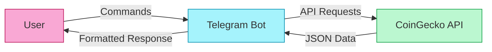

# 🤖 Telegram Cryptocurrency Bot 💰

<div align="center">
  
  
  
  
</div>

<div align="center">
  <p>A lightweight Telegram bot providing real-time cryptocurrency data using the CoinGecko API.</p>
</div>

## 📋 Features

- 📊 View top cryptocurrencies by market cap
- 🔥 Discover trending cryptocurrencies
- 💹 Track prices and 24h changes
- 🚀 Simple command interface
- ⚡ Fast, real-time data

## 🗺️ Architecture Overview



## 📦 Prerequisites

<table>
  <tr>
    <th>Requirement</th>
    <th>Version</th>
    <th>Purpose</th>
  </tr>
  <tr>
    <td>🟢 Node.js</td>
    <td>v14 or higher</td>
    <td>Runtime environment</td>
  </tr>
  <tr>
    <td>📦 npm</td>
    <td>Latest</td>
    <td>Package management</td>
  </tr>
  <tr>
    <td>💬 Telegram</td>
    <td>Account</td>
    <td>Bot deployment</td>
  </tr>
</table>

## 🚀 Installation Steps

### 1️⃣ Clone Repository or Create Project Folder

```bash
mkdir crypto-telegram-bot
cd crypto-telegram-bot
```

### 2️⃣ Initialize Project

```bash
npm init -y
```

### 3️⃣ Install Dependencies

```bash
npm install node-telegram-bot-api axios dotenv
```

### 4️⃣ Create Bot on Telegram

<div align="center">
  <table>
    <tr>
      <td align="center"><b>Step</b></td>
      <td align="center"><b>Action</b></td>
    </tr>
    <tr>
      <td>1</td>
      <td>Open Telegram and search for <code>@BotFather</code></td>
    </tr>
    <tr>
      <td>2</td>
      <td>Send the command <code>/newbot</code></td>
    </tr>
    <tr>
      <td>3</td>
      <td>Follow the instructions to name your bot</td>
    </tr>
    <tr>
      <td>4</td>
      <td>Save the API token provided by BotFather</td>
    </tr>
  </table>
</div>

### 5️⃣ Configure Environment Variables

Create a `.env` file in your project root:

```
TELEGRAM_BOT_TOKEN=your_telegram_bot_token_here
```

### 6️⃣ Create Main Bot File

Create an `index.js` file with the bot code. The implementation includes:

- 🔄 Command handlers for `/start`, `/help`, `/top`, and `/hot`
- 🔌 CoinGecko API integration
- 🎨 Formatted responses with emojis and Markdown
- ⚠️ Error handling for API failures

<details>
<summary>📄 View Sample Bot Code Structure</summary>

```javascript
// 1. Import dependencies
const TelegramBot = require('node-telegram-bot-api');
const axios = require('axios');
require('dotenv').config();

// 2. Environment configuration
const TOKEN = process.env.TELEGRAM_BOT_TOKEN;
const COINGECKO_API_BASE = 'https://api.coingecko.com/api/v3';

// 3. Initialize bot with polling
const bot = new TelegramBot(TOKEN, { polling: true });

// 4. API integration layer
const cryptoAPI = {
  // Methods for fetching cryptocurrency data
};

// 5. Response formatter
const formatter = {
  // Methods for formatting responses
};

// 6. Command handlers
bot.onText(/\/start/, (msg) => {
  // Handle start command
});

bot.onText(/\/help/, (msg) => {
  // Handle help command
});

bot.onText(/\/top/, async (msg) => {
  // Handle top command
});

bot.onText(/\/hot/, async (msg) => {
  // Handle hot command
});

// 7. Error handler
bot.on('polling_error', (error) => {
  console.error('Polling error:', error);
});

// 8. Start the bot
console.log('Bot is running...');
```
</details>

### 7️⃣ Start the Bot

```bash
node index.js
```

## 📱 Bot Commands

<div align="center">
  <table>
    <tr>
      <th>Command</th>
      <th>Description</th>
      <th>Example Response</th>
    </tr>
    <tr>
      <td><code>/start</code></td>
      <td>Initialize bot and view available commands</td>
      <td>Welcome message with command list</td>
    </tr>
    <tr>
      <td><code>/help</code></td>
      <td>Display help information</td>
      <td>List of available commands</td>
    </tr>
    <tr>
      <td><code>/top</code></td>
      <td>Show top cryptocurrencies by market cap</td>
      <td>
        🔸 <b>TOP CRYPTOCURRENCIES</b> 🔸<br>
        1. <b>Bitcoin</b> (BTC)<br>
        &nbsp;&nbsp;&nbsp;💰 $68,543.21<br>
        &nbsp;&nbsp;&nbsp;📊 24h: 🟢 2.45%<br>
        &nbsp;&nbsp;&nbsp;🧢 $1,345.67B
      </td>
    </tr>
    <tr>
      <td><code>/hot</code></td>
      <td>Display trending cryptocurrencies</td>
      <td>
        🔥 <b>TRENDING CRYPTOCURRENCIES</b> 🔥<br>
        1. <b>Solana</b> (SOL)<br>
        &nbsp;&nbsp;&nbsp;📈 Market Cap Rank: 5<br>
        &nbsp;&nbsp;&nbsp;📊 Score: 0.998
      </td>
    </tr>
  </table>
</div>

## 🔧 Maintenance Notes

<blockquote>
<p>💡 <b>Important:</b> The free CoinGecko API has rate limits (approximately 50 calls per minute). Consider implementing caching for production deployments.</p>
</blockquote>

- ⏱️ API has rate limits (~50 calls/minute)
- 🗄️ Consider implementing a simple cache to reduce API calls
- 🔄 Restart the bot process if it disconnects or encounters errors
- 🔒 For long-term deployment, secure your bot token appropriately

## 🛠️ Troubleshooting

| Issue | Solution |
|-------|----------|
| Bot doesn't respond | Verify your token is correct in the `.env` file |
| API calls fail | Check network connectivity and [CoinGecko API status](https://status.coingecko.com/) |
| Deployment issues | For persistent deployment, use a process manager like [PM2](https://pm2.keymetrics.io/) |
| Rate limiting | Implement caching or reduce command frequency |

## 🚀 Deployment Options

For persistent deployment, consider these options:

- **PM2**: `npm install -g pm2 && pm2 start index.js`
- **Docker**: Create a container for portable deployment
- **Cloud Platforms**: Deploy on Heroku, Railway, or Render with free tiers

## 📊 Sample Output

<div align="center">
  <table>
    <tr>
      <td>
        <pre>
🔸 <b>TOP CRYPTOCURRENCIES</b> 🔸

1. <b>Bitcoin</b> (BTC)
   💰 $68,543.21
   📊 24h: 🟢 2.45%
   🧢 $1,345.67B

2. <b>Ethereum</b> (ETH)
   💰 $3,456.78
   📊 24h: 🟢 1.23%
   🧢 $416.78B

3. <b>BNB</b> (BNB)
   💰 $567.89
   📊 24h: 🔴 0.45%
   🧢 $87.65B
        </pre>
      </td>
    </tr>
  </table>
</div>

## 📝 License

This project is licensed under the MIT License.

---

<div align="center">
  <p>Made with ❤️ by <a href="https://github.com/Yash-Kavaiya">Yash Kavaiya</a></p>
  <p>⭐ Star this repository if you find it useful! ⭐</p>
</div>
