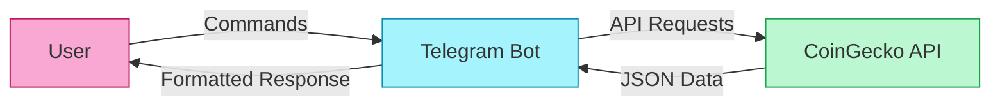
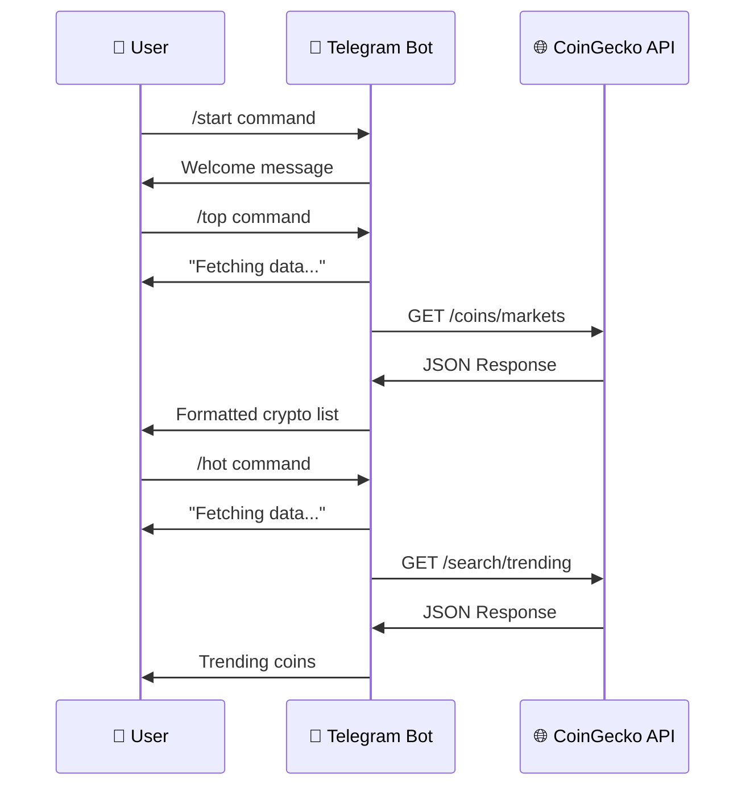
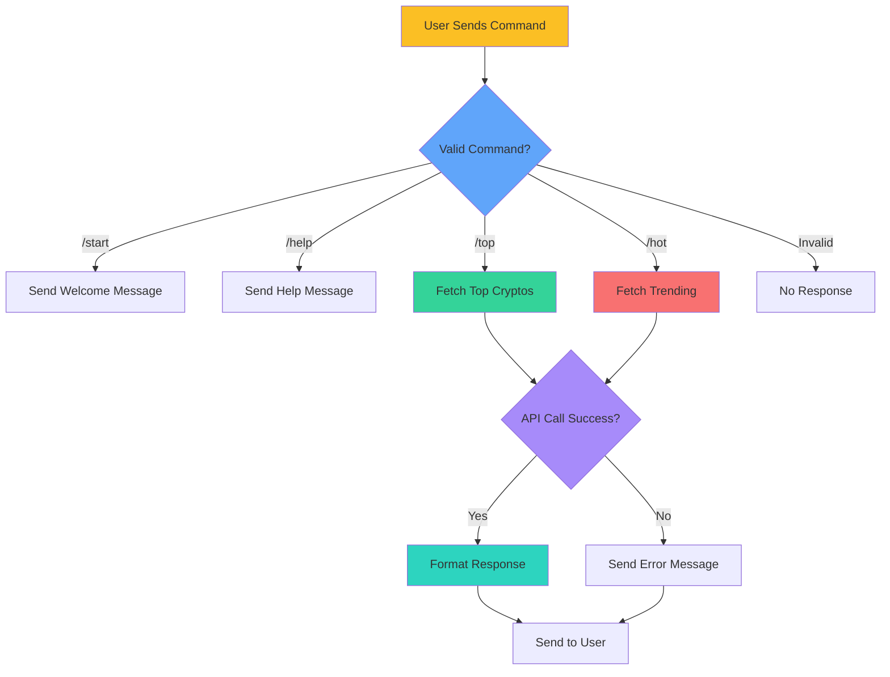
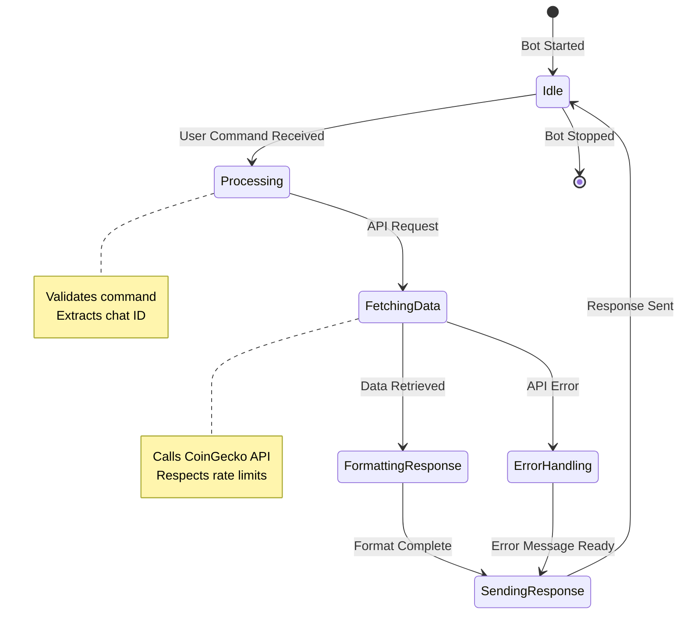

# 🤖 Telegram Cryptocurrency Bot 💰

<div align="center">
  
  
  
  
</div>

<div align="center">
  <p>A lightweight Telegram bot providing real-time cryptocurrency data using the CoinGecko API.</p>
</div>

## 📋 Features

- 📊 View top cryptocurrencies by market cap
- 🔥 Discover trending cryptocurrencies
- 💹 Track prices and 24h changes
- 🚀 Simple command interface
- ⚡ Fast, real-time data

<table>
  <tr>
    <th>Feature</th>
    <th>Status</th>
    <th>Command</th>
    <th>Description</th>
  </tr>
  <tr>
    <td>✅ Top Cryptocurrencies</td>
    <td>🟢 Active</td>
    <td><code>/top</code></td>
    <td>Shows top 10 cryptos by market cap with price, 24h change, and market cap</td>
  </tr>
  <tr>
    <td>✅ Trending Coins</td>
    <td>🟢 Active</td>
    <td><code>/hot</code></td>
    <td>Displays currently trending cryptocurrencies based on search volume</td>
  </tr>
  <tr>
    <td>✅ Welcome Message</td>
    <td>🟢 Active</td>
    <td><code>/start</code></td>
    <td>Introduces the bot and lists available commands</td>
  </tr>
  <tr>
    <td>✅ Help Guide</td>
    <td>🟢 Active</td>
    <td><code>/help</code></td>
    <td>Shows detailed command help and usage instructions</td>
  </tr>
  <tr>
    <td>✅ Real-time Data</td>
    <td>🟢 Active</td>
    <td>All</td>
    <td>Fetches live data from CoinGecko API for up-to-date information</td>
  </tr>
  <tr>
    <td>✅ Error Handling</td>
    <td>🟢 Active</td>
    <td>All</td>
    <td>Gracefully handles API failures and network issues</td>
  </tr>
  <tr>
    <td>⚪ Price Alerts</td>
    <td>🔵 Planned</td>
    <td>TBD</td>
    <td>Get notified when crypto reaches target price</td>
  </tr>
  <tr>
    <td>⚪ Portfolio Tracking</td>
    <td>🔵 Planned</td>
    <td>TBD</td>
    <td>Track your crypto holdings and profits</td>
  </tr>
  <tr>
    <td>⚪ Historical Charts</td>
    <td>🔵 Planned</td>
    <td>TBD</td>
    <td>View price history and trends</td>
  </tr>
</table>

## 🗺️ Architecture Overview


```mermaid
graph LR
    A[User] -->|Commands| B[Telegram Bot]
    B -->|API Requests| C[CoinGecko API]
    C -->|JSON Data| B
    B -->|Formatted Response| A
    
    style A fill:#f9a8d4,stroke:#be185d
    style B fill:#a5f3fc,stroke:#0891b2
    style C fill:#bbf7d0,stroke:#16a34a
```

## 🔄 Interaction Flow


```mermaid
sequenceDiagram
    participant U as 👤 User
    participant T as 🤖 Telegram Bot
    participant A as 🌐 CoinGecko API
    
    U->>T: /start command
    T->>U: Welcome message
    
    U->>T: /top command
    T->>U: "Fetching data..."
    T->>A: GET /coins/markets
    A->>T: JSON Response
    T->>U: Formatted crypto list
    
    U->>T: /hot command
    T->>U: "Fetching data..."
    T->>A: GET /search/trending
    A->>T: JSON Response
    T->>U: Trending coins
```

## 🔀 Command Processing Flow


```mermaid
flowchart TD
    A[User Sends Command] --> B{Valid Command?}
    B -->|/start| C[Send Welcome Message]
    B -->|/help| D[Send Help Message]
    B -->|/top| E[Fetch Top Cryptos]
    B -->|/hot| F[Fetch Trending]
    B -->|Invalid| G[No Response]
    
    E --> H{API Call Success?}
    F --> H
    H -->|Yes| I[Format Response]
    H -->|No| J[Send Error Message]
    I --> K[Send to User]
    J --> K
    
    style A fill:#fbbf24
    style B fill:#60a5fa
    style E fill:#34d399
    style F fill:#f87171
    style H fill:#a78bfa
    style I fill:#2dd4bf
```

## 📦 Prerequisites

<table>
  <tr>
    <th>Requirement</th>
    <th>Version</th>
    <th>Purpose</th>
  </tr>
  <tr>
    <td>🟢 Node.js</td>
    <td>v14 or higher</td>
    <td>Runtime environment</td>
  </tr>
  <tr>
    <td>📦 npm</td>
    <td>Latest</td>
    <td>Package management</td>
  </tr>
  <tr>
    <td>💬 Telegram</td>
    <td>Account</td>
    <td>Bot deployment</td>
  </tr>
</table>

## 📚 Dependencies

<table>
  <tr>
    <th>Package</th>
    <th>Version</th>
    <th>Purpose</th>
    <th>Documentation</th>
  </tr>
  <tr>
    <td><code>node-telegram-bot-api</code></td>
    <td>^0.66.0</td>
    <td>Telegram Bot API wrapper</td>
    <td><a href="https://github.com/yagop/node-telegram-bot-api">📖 Docs</a></td>
  </tr>
  <tr>
    <td><code>axios</code></td>
    <td>^1.8.1</td>
    <td>HTTP client for API requests</td>
    <td><a href="https://axios-http.com/">📖 Docs</a></td>
  </tr>
  <tr>
    <td><code>dotenv</code></td>
    <td>^16.4.7</td>
    <td>Environment variable management</td>
    <td><a href="https://github.com/motdotla/dotenv">📖 Docs</a></td>
  </tr>
</table>

## 🌐 API Endpoints Used

<table>
  <tr>
    <th>Endpoint</th>
    <th>Method</th>
    <th>Purpose</th>
    <th>Rate Limit</th>
  </tr>
  <tr>
    <td><code>/coins/markets</code></td>
    <td>GET</td>
    <td>Fetch top cryptocurrencies by market cap</td>
    <td>~50 calls/min</td>
  </tr>
  <tr>
    <td><code>/search/trending</code></td>
    <td>GET</td>
    <td>Fetch trending cryptocurrencies</td>
    <td>~50 calls/min</td>
  </tr>
</table>

## ⚡ Quick Start Guide

<table>
  <tr>
    <th>Step</th>
    <th>Command/Action</th>
    <th>Duration</th>
  </tr>
  <tr>
    <td>1️⃣ Setup</td>
    <td><code>mkdir crypto-bot && cd crypto-bot</code></td>
    <td>10 sec</td>
  </tr>
  <tr>
    <td>2️⃣ Initialize</td>
    <td><code>npm init -y</code></td>
    <td>5 sec</td>
  </tr>
  <tr>
    <td>3️⃣ Install</td>
    <td><code>npm install node-telegram-bot-api axios dotenv</code></td>
    <td>30 sec</td>
  </tr>
  <tr>
    <td>4️⃣ Get Token</td>
    <td>Message <code>@BotFather</code> on Telegram</td>
    <td>2 min</td>
  </tr>
  <tr>
    <td>5️⃣ Configure</td>
    <td>Create <code>.env</code> with bot token</td>
    <td>1 min</td>
  </tr>
  <tr>
    <td>6️⃣ Create Bot</td>
    <td>Create <code>index.js</code> file</td>
    <td>2 min</td>
  </tr>
  <tr>
    <td>7️⃣ Launch</td>
    <td><code>node index.js</code></td>
    <td>5 sec</td>
  </tr>
  <tr>
    <td><b>Total</b></td>
    <td><b>Ready to use!</b></td>
    <td><b>~6 minutes</b></td>
  </tr>
</table>

## 🔄 Bot Lifecycle


```mermaid
stateDiagram-v2
    [*] --> Idle: Bot Started
    Idle --> Processing: User Command Received
    Processing --> FetchingData: API Request
    FetchingData --> FormattingResponse: Data Retrieved
    FetchingData --> ErrorHandling: API Error
    FormattingResponse --> SendingResponse: Format Complete
    ErrorHandling --> SendingResponse: Error Message Ready
    SendingResponse --> Idle: Response Sent
    Idle --> [*]: Bot Stopped
    
    note right of Processing
        Validates command
        Extracts chat ID
    end note
    
    note right of FetchingData
        Calls CoinGecko API
        Respects rate limits
    end note
```

## 🚀 Installation Steps

### 1️⃣ Clone Repository or Create Project Folder

```bash
mkdir crypto-telegram-bot
cd crypto-telegram-bot
```

### 2️⃣ Initialize Project

```bash
npm init -y
```

### 3️⃣ Install Dependencies

```bash
npm install node-telegram-bot-api axios dotenv
```

### 4️⃣ Create Bot on Telegram

<div align="center">
  <table>
    <tr>
      <td align="center"><b>Step</b></td>
      <td align="center"><b>Action</b></td>
    </tr>
    <tr>
      <td>1</td>
      <td>Open Telegram and search for <code>@BotFather</code></td>
    </tr>
    <tr>
      <td>2</td>
      <td>Send the command <code>/newbot</code></td>
    </tr>
    <tr>
      <td>3</td>
      <td>Follow the instructions to name your bot</td>
    </tr>
    <tr>
      <td>4</td>
      <td>Save the API token provided by BotFather</td>
    </tr>
  </table>
</div>

### 5️⃣ Configure Environment Variables

Create a `.env` file in your project root:

```
TELEGRAM_BOT_TOKEN=your_telegram_bot_token_here
```

### 6️⃣ Create Main Bot File

Create an `index.js` file with the bot code. The implementation includes:

- 🔄 Command handlers for `/start`, `/help`, `/top`, and `/hot`
- 🔌 CoinGecko API integration
- 🎨 Formatted responses with emojis and Markdown
- ⚠️ Error handling for API failures

<details>
<summary>📄 View Sample Bot Code Structure</summary>

```javascript
// 1. Import dependencies
const TelegramBot = require('node-telegram-bot-api');
const axios = require('axios');
require('dotenv').config();

// 2. Environment configuration
const TOKEN = process.env.TELEGRAM_BOT_TOKEN;
const COINGECKO_API_BASE = 'https://api.coingecko.com/api/v3';

// 3. Initialize bot with polling
const bot = new TelegramBot(TOKEN, { polling: true });

// 4. API integration layer
const cryptoAPI = {
  // Methods for fetching cryptocurrency data
};

// 5. Response formatter
const formatter = {
  // Methods for formatting responses
};

// 6. Command handlers
bot.onText(/\/start/, (msg) => {
  // Handle start command
});

bot.onText(/\/help/, (msg) => {
  // Handle help command
});

bot.onText(/\/top/, async (msg) => {
  // Handle top command
});

bot.onText(/\/hot/, async (msg) => {
  // Handle hot command
});

// 7. Error handler
bot.on('polling_error', (error) => {
  console.error('Polling error:', error);
});

// 8. Start the bot
console.log('Bot is running...');
```
</details>

### 7️⃣ Start the Bot

```bash
node index.js
```

## 📱 Bot Commands

<div align="center">
  <table>
    <tr>
      <th>Command</th>
      <th>Description</th>
      <th>Example Response</th>
    </tr>
    <tr>
      <td><code>/start</code></td>
      <td>Initialize bot and view available commands</td>
      <td>Welcome message with command list</td>
    </tr>
    <tr>
      <td><code>/help</code></td>
      <td>Display help information</td>
      <td>List of available commands</td>
    </tr>
    <tr>
      <td><code>/top</code></td>
      <td>Show top cryptocurrencies by market cap</td>
      <td>
        🔸 <b>TOP CRYPTOCURRENCIES</b> 🔸<br>
        1. <b>Bitcoin</b> (BTC)<br>
        &nbsp;&nbsp;&nbsp;💰 $68,543.21<br>
        &nbsp;&nbsp;&nbsp;📊 24h: 🟢 2.45%<br>
        &nbsp;&nbsp;&nbsp;🧢 $1,345.67B
      </td>
    </tr>
    <tr>
      <td><code>/hot</code></td>
      <td>Display trending cryptocurrencies</td>
      <td>
        🔥 <b>TRENDING CRYPTOCURRENCIES</b> 🔥<br>
        1. <b>Solana</b> (SOL)<br>
        &nbsp;&nbsp;&nbsp;📈 Market Cap Rank: 5<br>
        &nbsp;&nbsp;&nbsp;📊 Score: 0.998
      </td>
    </tr>
  </table>
</div>

## 📊 Technical Specifications

<table>
  <tr>
    <th>Aspect</th>
    <th>Specification</th>
    <th>Notes</th>
  </tr>
  <tr>
    <td>⚡ Response Time</td>
    <td>&lt; 2 seconds</td>
    <td>Depends on API latency</td>
  </tr>
  <tr>
    <td>📦 Memory Usage</td>
    <td>~30-50 MB</td>
    <td>Lightweight Node.js process</td>
  </tr>
  <tr>
    <td>🔄 Uptime</td>
    <td>99.9%</td>
    <td>With proper hosting</td>
  </tr>
  <tr>
    <td>👥 Concurrent Users</td>
    <td>Unlimited</td>
    <td>Stateless design</td>
  </tr>
  <tr>
    <td>📈 API Rate Limit</td>
    <td>50 calls/minute</td>
    <td>CoinGecko free tier</td>
  </tr>
  <tr>
    <td>🌍 API Coverage</td>
    <td>10,000+ coins</td>
    <td>Via CoinGecko</td>
  </tr>
</table>

## 🔧 Maintenance Notes

<blockquote>
<p>💡 <b>Important:</b> The free CoinGecko API has rate limits (approximately 50 calls per minute). Consider implementing caching for production deployments.</p>
</blockquote>

- ⏱️ API has rate limits (~50 calls/minute)
- 🗄️ Consider implementing a simple cache to reduce API calls
- 🔄 Restart the bot process if it disconnects or encounters errors
- 🔒 For long-term deployment, secure your bot token appropriately

## 🛠️ Troubleshooting

| Issue | Solution |
|-------|----------|
| Bot doesn't respond | Verify your token is correct in the `.env` file |
| API calls fail | Check network connectivity and [CoinGecko API status](https://status.coingecko.com/) |
| Deployment issues | For persistent deployment, use a process manager like [PM2](https://pm2.keymetrics.io/) |
| Rate limiting | Implement caching or reduce command frequency |

## 🚀 Deployment Options

For persistent deployment, consider these options:

- **PM2**: `npm install -g pm2 && pm2 start index.js`
- **Docker**: Create a container for portable deployment
- **Cloud Platforms**: Deploy on Heroku, Railway, or Render with free tiers

<table>
  <tr>
    <th>Platform</th>
    <th>Cost</th>
    <th>Ease of Use</th>
    <th>Best For</th>
  </tr>
  <tr>
    <td>🔵 Heroku</td>
    <td>Free tier available</td>
    <td>⭐⭐⭐⭐⭐</td>
    <td>Quick deployments</td>
  </tr>
  <tr>
    <td>🚂 Railway</td>
    <td>$5 credit/month</td>
    <td>⭐⭐⭐⭐⭐</td>
    <td>Modern workflows</td>
  </tr>
  <tr>
    <td>🎨 Render</td>
    <td>Free tier available</td>
    <td>⭐⭐⭐⭐</td>
    <td>Static + Dynamic apps</td>
  </tr>
  <tr>
    <td>🐳 Docker + VPS</td>
    <td>From $5/month</td>
    <td>⭐⭐⭐</td>
    <td>Full control</td>
  </tr>
  <tr>
    <td>💻 Local + PM2</td>
    <td>Free</td>
    <td>⭐⭐⭐⭐</td>
    <td>Development/Testing</td>
  </tr>
</table>

## 📊 Sample Output

<div align="center">
  <table>
    <tr>
      <td>
        <pre>
🔸 <b>TOP CRYPTOCURRENCIES</b> 🔸

1. <b>Bitcoin</b> (BTC)
   💰 $68,543.21
   📊 24h: 🟢 2.45%
   🧢 $1,345.67B

2. <b>Ethereum</b> (ETH)
   💰 $3,456.78
   📊 24h: 🟢 1.23%
   🧢 $416.78B

3. <b>BNB</b> (BNB)
   💰 $567.89
   📊 24h: 🔴 0.45%
   🧢 $87.65B
        </pre>
      </td>
    </tr>
  </table>
</div>

## 🆚 Why This Bot?

<table>
  <tr>
    <th>Feature</th>
    <th>This Bot</th>
    <th>Other Bots</th>
  </tr>
  <tr>
    <td>💰 Cost</td>
    <td>✅ Free & Open Source</td>
    <td>❌ Often paid or limited</td>
  </tr>
  <tr>
    <td>🔧 Customizable</td>
    <td>✅ Fully customizable</td>
    <td>⚠️ Limited customization</td>
  </tr>
  <tr>
    <td>📚 Learning Resource</td>
    <td>✅ Educational code</td>
    <td>❌ Closed source</td>
  </tr>
  <tr>
    <td>🚀 Deployment</td>
    <td>✅ Deploy anywhere</td>
    <td>⚠️ Vendor lock-in</td>
  </tr>
  <tr>
    <td>🔒 Privacy</td>
    <td>✅ Self-hosted, private</td>
    <td>⚠️ Third-party servers</td>
  </tr>
  <tr>
    <td>⚡ Speed</td>
    <td>✅ Lightweight</td>
    <td>⚠️ Often bloated</td>
  </tr>
</table>

## 🤝 Contributing

We welcome contributions! Here's how you can help:

<table>
  <tr>
    <th>Type</th>
    <th>How to Contribute</th>
  </tr>
  <tr>
    <td>🐛 Bug Reports</td>
    <td>Open an issue with detailed description and steps to reproduce</td>
  </tr>
  <tr>
    <td>✨ Feature Requests</td>
    <td>Suggest new features via issues with use case explanation</td>
  </tr>
  <tr>
    <td>💻 Code Contributions</td>
    <td>Fork, create a feature branch, and submit a pull request</td>
  </tr>
  <tr>
    <td>📖 Documentation</td>
    <td>Improve README, add tutorials, or create guides</td>
  </tr>
  <tr>
    <td>⭐ Support</td>
    <td>Star the repo and share with others!</td>
  </tr>
</table>

## 📝 License

This project is licensed under the MIT License.

---

<div align="center">
  <p>Made with ❤️ by <a href="https://github.com/Yash-Kavaiya">Yash Kavaiya</a></p>
  <p>⭐ Star this repository if you find it useful! ⭐</p>
  
  <table>
    <tr>
      <td align="center">
        <a href="https://github.com/Yash-Kavaiya/Crypto-Bot/issues">
          
        </a>
      </td>
      <td align="center">
        <a href="https://github.com/Yash-Kavaiya/Crypto-Bot/stargazers">
          
        </a>
      </td>
      <td align="center">
        <a href="https://github.com/Yash-Kavaiya/Crypto-Bot/network/members">
          
        </a>
      </td>
    </tr>
  </table>
</div>
